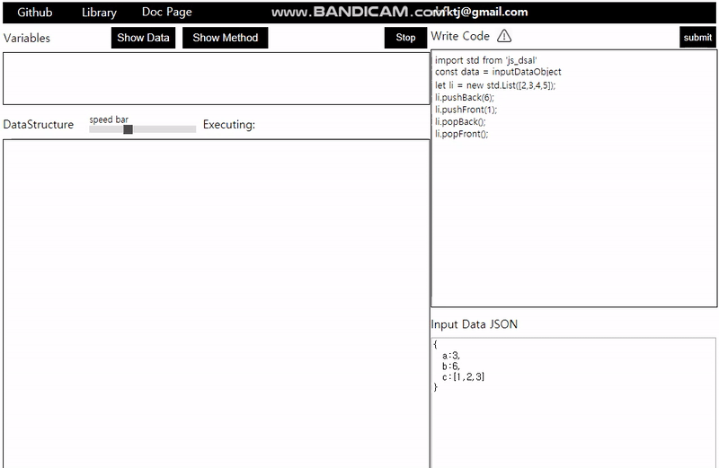
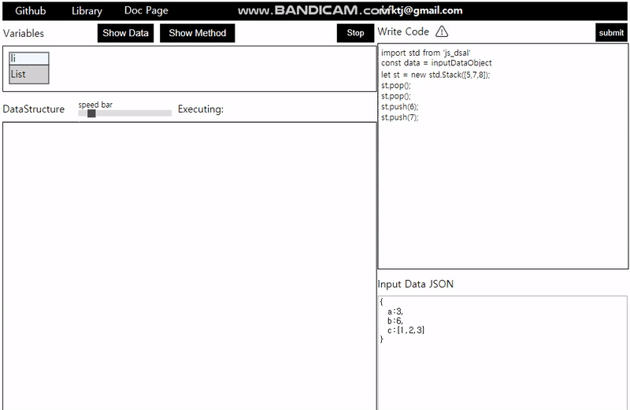
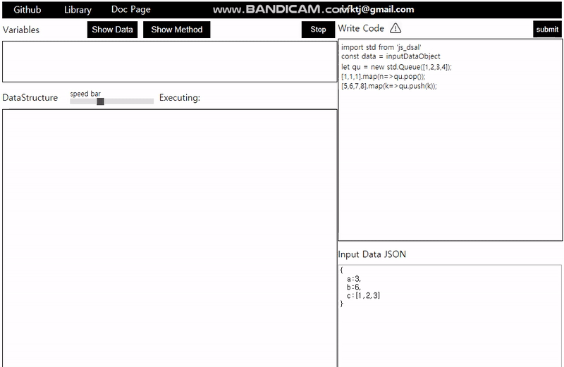
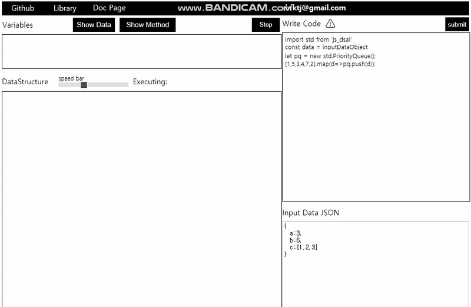
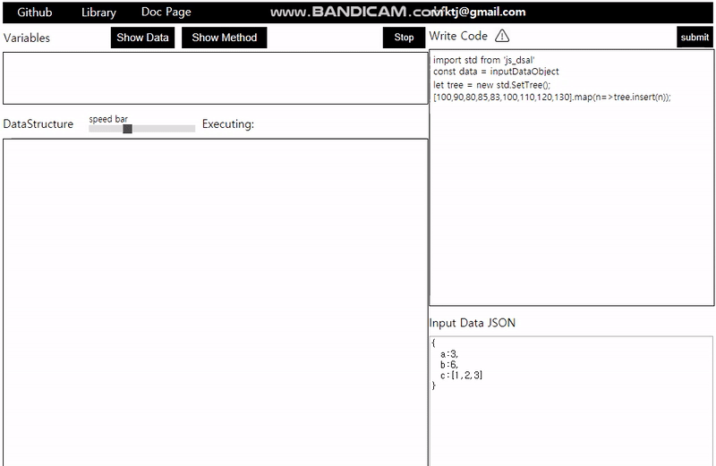
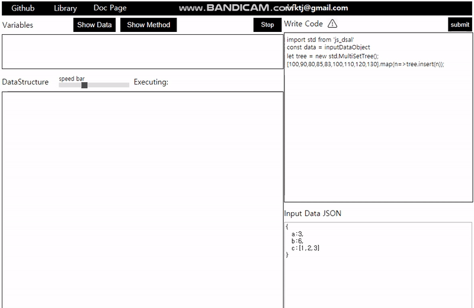
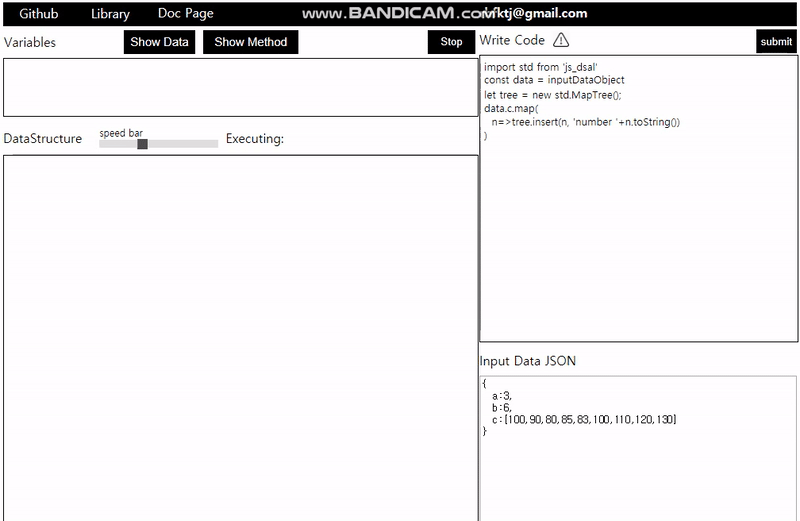

# **Javascript Data Structure Visualization**
- Web Page made by react

## **PurPose**
Data Structure Visualization Web Frontend with npm package 'js_dsal'  

The purpose of this project is to analyze arbitrary javascript code and visually show how the methods of 'js_dsal' works during the program execution.  
In addition, when the methods of 'js_dsal' is executed, it shows the state of the data in memory and it can visually check the static state of the class of 'js_dsal' among the data.  
It can act as a kind of debugger by tracking the state of the data.

User can write down code using 'js_dsal' and JSON data.  
User can arbitrary select one of the method lists to confirm the operation.  

  


### **Install dependencies**
```
yarn build
```
**Precaution**  
For deploy webpage, you should change the package.json homepage to "."  
If not, the relative path makes error.

### **Run Page**
```
npm start
```

## **Implement Static Data Structure**
- **List**

## **Implemented Method**
### **list**
- pushBack
- popBack
- pushFront
- popFront  



### **Stack**
- push
- pop  



### **queue**
- push
- pop  



### **priority queue**
- push
- pop



### **SetTree**
- insert



### **MultiSetTree**
- insert



### **MapTree**
- insert



### **MultiMapTree**
- insert
